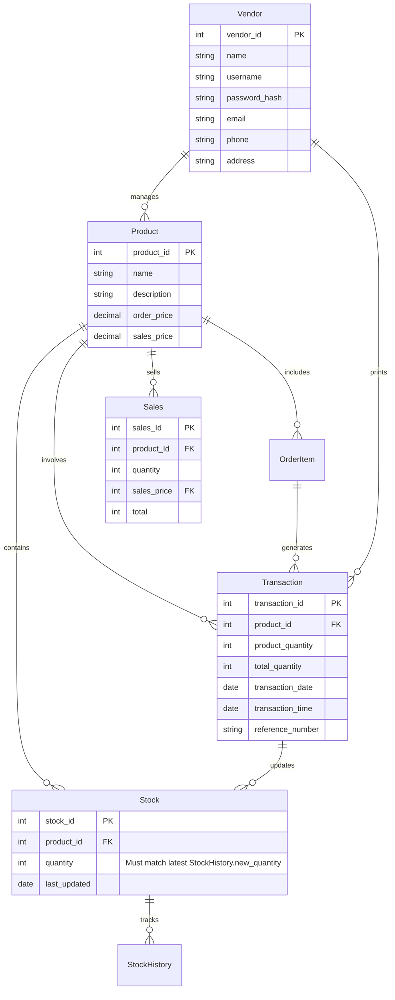

```mermaid
erDiagram
    Product {
        int product_id PK
        string name
        string description
        decimal order_price
        decimal sales_price
    }

    Stock {
        int stock_id PK
        int product_id FK
        int quantity "Must match latest StockHistory.new_quantity"
        date last_updated
    }

    Sales{
        int sales_Id PK
        int product_Id FK
        int quantity
        int sales_price FK
        int total
    }

    Vendor {
        int vendor_id PK
        string name
        string username
        string password_hash
        string email
        string phone
        string address
    }

    Transaction {
        int transaction_id PK
        int product_id FK
        int product_quantity
        int total_quantity
        date transaction_date
        date transaction_time
        string reference_number
    }

    Product ||--o{ Stock : contains
    Product ||--o{ Transaction : involves
    Product ||--o{ Sales: sells
    Vendor ||--o{ Product : manages
    Vendor ||--o{ Transaction : prints
    OrderItem ||--o{ Transaction : generates
    Product ||--o{ OrderItem : includes
    Transaction ||--o{ Stock : updates
    Stock ||--o{ StockHistory : tracks
```